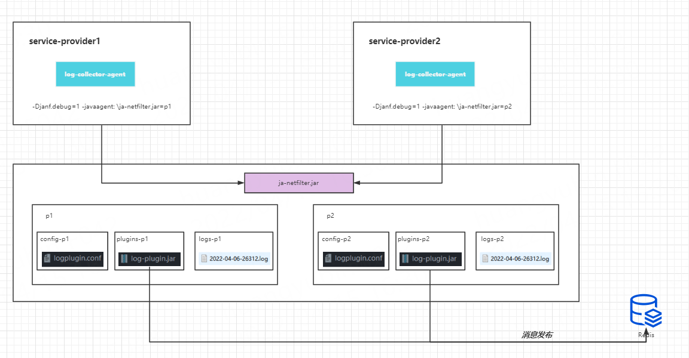

## log-collector
### 基于ja-netfilter.jar的字节码插桩日志中搜集器

基于javaagent的日志收集器，跨应用日志收集插件

demo-consumer -- demo服务消费者，通过集成log-sub以及websocket starter，实现订阅消息，以及推送到websocket
 
demo-provider、demo-provider2 -- 服务提供者demo ， 使用-javaagent指定增强器，在代码中通过log.info(marker,log)实现日志收集

log-collector-agent -- 基于ja-netfilter.jar和jedis的字节码插桩日志中搜集器

log-collector-common -- 日志的marker类定义
 
log-subscriber -- 日志订阅实现 

websocket-starter -- websocket的springbootstarter ，在pom中引入即可开启项目的websocket

